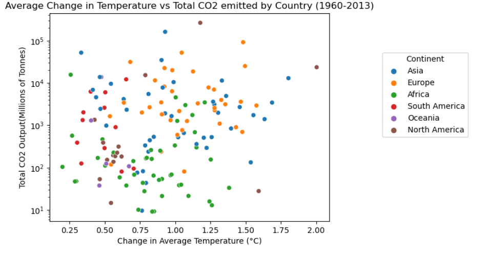

# Final report - Emissions Impossible (Group 42)

Climate change is one of the most pressing issues of our time, with far-reaching impacts on the environment, society, and the economy. Our data science project seeks to analyze and understand the complex dynamics of climate change in a manner that is both easy to understand and interesting to the average person. By utilizing the method of Exploratory Data Analysis (EDA) to a diverse range of environmental and economic datasets, we hope to uncover insights that can inform policymakers, businesses, and individuals in their efforts to mitigate and adapt to the effects of climate change. This project is important because it seeks to provide data-driven insights into one of the most critical challenges of our time, and can help us make more informed decisions about how to tackle this issue.

Aidan's Research Question:

There is little doubt among scientists that the rapid rise in global temperature has been a direct result of civilization's carbon footprint. However, with this research question we would like to explore how much carbon emissions affect temperature on a local scale. In other words, I want to look for evidence that a country which produces large quantities of CO2 (such as the US or China) has had a higher spike in temperature than countries that produce less CO2 (Sub-Saharan Africa or South America).

In order to do this, a dataset which contained the average annual temperature for every country in the world and another dataset displaying CO2 emissions for every country were combined. Data from the year 1960-2013 was used for this research. The use of the geopandas library allowed for the quick plotting of beautiful global heat maps, which was used to plot the change in annual temperature between the average of 1960-1964 and 2009-2013. It is of note that every single country in the world had some sort of increase, albeit some more than others. 

While no clear pattern was easily drawn, some clusters of larger change could be identified. This led to the creation of a ridgeline plot which showed the change in temperature grouped by continent. The KDE plots gave a rough indication that the Afro-Eurasian landmass heated an entire degree more than the Americas and Oceania. This does provide evidence that there is some kind of locality about climate change, although the geopandas map of total CO2 emission from 1960-2013 did not reflect the same pattern

To finally answer the research question definitively, a scatterplot of change in temperature and total CO2 emissions was made where each country was a dot. Since some countries have magnitudes smaller population and landmass, a log scale was used for CO2 emissions. The resulting plot looked just about like random dots. Calculating the correlation between the two variables gave a slight positive relationship although some statistical calculations showed that it was not enough to provide statistically significant evidence of a relationship.

This exploratory data analysis did not provide any evidence that a country's CO2 output is directly tied to their change in temperature. This means that climate change is a problem that must be solved as a global civilization, and one country’s reduction in their carbon footprint will not provide results without the whole world following suit.

Rona's Research Question:

Wanting to take the climate crisis more seriously, this research question puts a focus point on natural disasters. To determine if there is a distinct relationship between natural disasters, carbon dioxide emission rates and average temperatures across continents; and can we assume that the natural disasters are induced by the climate crisis?  The research behind this question invlolved aggregating my data and manipulating it in ways that would allow me to compare the rates of global natural disterster with both global emission rates and global average temperatures. Originally this report only included the data sets of naturals disasters to be compared to the emissions data set however, after receiving a suggestion to also include temperatures by our teaching assistant, I have implemented it into my research. By cleaning, wrangling, and processing the raw data sets, I have created a processed version along with all of my analysis, which can be found [here](analysis/analysisRona.ipynb). The findings of my research includes sorting through the data by continents; Africa, Asia, Oceania, Europe, and the Americas (wich include both North and South America), and focusing on the year 1970 and onwards.
Plot A)  

This is a scatterplot which demonstrates the difference of natural disasters comparing the the previous year. In green, we can easily see that Europe has had consistently decreasing disasters in comparison to the previous year. By seeing this on the left, we can have an idea of where to look for europe in terms of average temperatures and carbon dioxide emissions. In contrast, on the right side we see Africa, Asia, and America quite sparsed out. This is key to remember because with their number of natural disasters increasing over the years, we would want to look at the other data to see if there is a positive relationship.

Plot B) 

Here, we have created a side by side plot displaying the increase of emissions over the years on the left, and the increase in natural disasters grouped by types on the right. In the scatterplot (Plot A), it was noted that the continents Asia, America and Africa have seen an increase in natural disasters; now to look over at Plot B), we can see similar trends of increase in natural disasters by its’ type, and the increase of global carbon dioxide emissions. In this plot, taking a closer look at Asia, which is the dark blue line on the left and orage on the right, we see that they are the peak for both plots. And if we look more carefully, floods and wildfires have been the natural disaster types increasing in asia as their emission rates have been. This relationship shows a consistent growth rate with both emission and natural disasters.

Plot C)  

Here in plot C) we are looking at the percentage difference of natural disasters compared to its previous year, along with average temperatures compared to its’ previous year. Just by looking at the variability of the plots here, lets first not Africa. Althought the temperature data set does not go all the way through to the present time like the others, our focus is still going to be on 1970 and onwards. Africas average temperatures have varied throughout the years, with the exception of cold years, and hot years, we can still make the assumption that their temperatures are unstable which could be a result of the climate crisis. Nonetheless, if we compare to the plot of the right, the natural disasters plot, we can still see how they have showed anthe greatest increase in floods and next storms. 

Africa’s unstable ranging temperatures, and Asia’s significantly increasing emission rates both show an increase when comparing  to the natural disasters increase and contrasting for other continents such as Oceania and Europe. Although, the Americas has some spikes in both plots, the relationship was not evident enough to confirm the relationship like Africa and Asia. This climate crisis impacts so many of us in our everyday lives, we just may not notice the correlations

Rumo's Research Question:

Lastly, the research question of this report entails investigating whether or not a country's economic success dependent on having a heavily industrialized economy with high emissions or can countries find a balance between being economically and environmentally prosperous? Specifically, this report investigates which countries experienced the highest growth in GDP per capita since 1980 and whether they were able to maintain low emissions while achieving economic prosperity. This allows for further analysis of the economies of these countries to determine if they could become the standard with which countries should aspire to follow. 

A quadrant plot was made with GDP and Emissions per capita being the two variables of interest. The four zones were labelled as follows:
- Group I: Countries with a low gdp per capita and low emissions per capita.
- Group II: Countries with a relatively low gdp capita and a high emissions per capita.
- Group III: Countries with a relatively high emissions per capita and a high gdp per capita.
- Group IV: Countries with a relatively low emissions per capita and a high gdp per capita.

The plot shows that majority of countries follows an expected relationship with majority of the countries either residing in groups I or III. However, it was decided that for a country to be both economically and environmentally prosperous it would need to have a GDP per capita greater than $20,000 per capita and an Emissions per capita less than 12 metric tons per capita. Thus, the focus of analysis would centre around Group IV.

A bar chart was then created which had the top sixteen countries in terms of change in GDP per capita since 1980 with countries such as Luxembourg, Ireland and Singapore ranking in the top three of those countries. From then on, the search was then further filtered to find which of these 16 countries have consistently had the lowest emissions per capita which were Iceland, Ireland and Canada.

Based on the violin plot, of the three countries, Canada had a siginificantly larger emissions per capita and was thus disregarded when investigating the economies of the countries. Ireland is an Ireland nation of 5 million people. Despite being a developed nation is able to to thrive without being overly reliant on an industrial sector due to its hand in argiculture and tourism. Moreover, Iceland is an even smaller island nation of approximately 400,000 people. Interestingly, Iceland is in a position where their economic success is in large part due to its use of its natural resources. Iceland is the world's largest electricity provider per capita with 99% of its energy coming from its abundance of hydroelectric dams and geothermal power sources. Thus, suggesting that although circumstances such as population size and natural resources likely play a role in a country's ability to be both environmentally and economically prosperous, it is possible to achieve that balance and thus the onus is on the governments of countries to find a way to achieve this balance. 

It is easy to be apathetic as we are fortunately live in a country that is yet to face the worst of what climate change has to offer, thus it is more with the ever-present threat of climate change looming over society with its exhaustive list of negative effects on the planet. After completing three exploratory data analyses, we have come to the conclusions that A) climate change is a problem that must be solved as a global civilization, and one country’s reduction in their carbon footprint will not provide results without the whole world following suit. B) A relationship between an increase in natural disasters can be seen along with an increase in emissions and instability in average temperatures. And lastly C) It is infact possible to be both environmentally conscious and economically prosperous. Correlation does not always mean causation however, our analyses show strong relationships and with further future research, these relationships will cause irreversible detrimental effects on our planet, our home.

